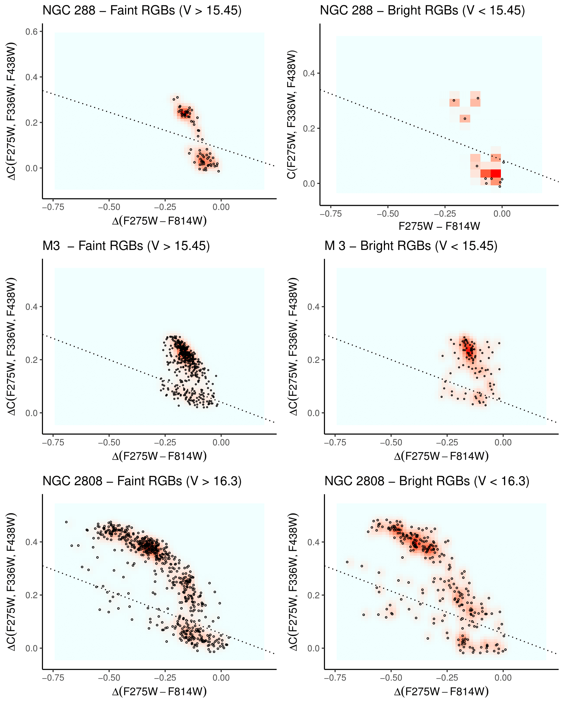
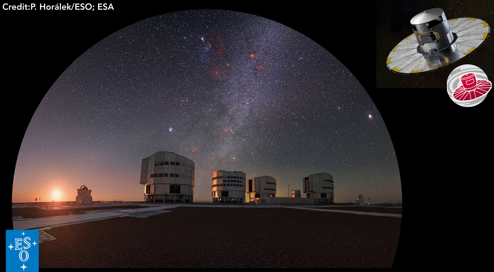
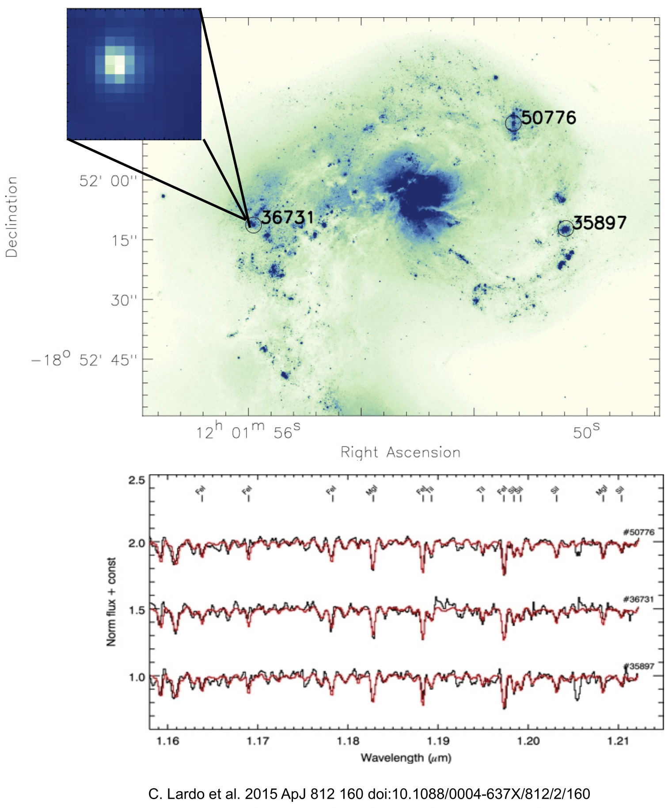

Stellar populations contain essential information on the formation and evolution of galaxies. 
We are able to trace the evolution of galaxies back to their formation by deriving elemental abundances of individual stars as well as measuring integrated light from unresolved stellar clusters. 
To understand how galaxies formed and evolved I followed different yet complementary lines of investigation.

 **Keywords**: Observational Astrophysics; Stellar Populations; Star Clusters; Milky Way Formation and Evolution; Stellar Evolution; Stellar Abundances.

******

#### **The Mystery of the Multiple Populations in Stellar Clusters**

The notion that GCs represent the textbook definition of a simple stellar population (SSP) with stars having the same age and the same chemistry has undergone a radical change in the past decades. GCs host MPs of stars with spreads in helium (He), many light elements – carbon (C), nitrogen (N), oxygen (O), sodium (Na), magnesium (Mg) – and even iron (Fe) in a few cases (e.g.; Gratton, Sneden & Carretta 2004, Lee et al. 1999, Gratton, Carretta & Bragaglia 2012; Schiavon et al. 2013; Milone et al. 2017). Scenarios for the origin of the MPs require the occurrence of several star formation events during GC infancy: stars with primordial composition (1P) are the first that formed in a single formation episode and with the same composition. Stars with enhanced He, N, and Na abundances (2P) were formed some tens/hundreds of Myr later from ejecta of massive stars from the first generation which are mixed to various degrees with some unprocessed gas
(e.g.; Decressin et al. 2007, D'Ercole et al. 2010, D'Antona et al. 2016, Charbonnel 2016).

Despite considerable efforts from the community (e.g., Bastian & Lardo 2018), the origin of the MPs is still unknown, with all proposed models facing significant problems (Rensini 2008, Larsen, Strader & Brodie 2012, Kruijssen 2015, Renzini et al. 2015 among others). In particular, we cannot use GCs to constrain the hierarchical assembly of galaxies as long as their formation mechanism remains a mystery. The investigation of the MPs is a very active field, with > 450 articles published since 2010, indicating the strong interest of the community in this topic. The field is also rapidly evolving, as the current status of the research is discussed in two reviews (Bastian & Lardo 2018, Gratton et al. 2019) which comes less than ten years after the last one Gratton, Carretta & Bragaglia 2012).

The discovery that globular clusters (GCs) do not fit within the traditional picture of being composed by stars with the same age and chemical abundances within some small tolerance has led to a growing interest in cluster studies. GCs host multiple populations (MPs) of stars with spreads in He and many other light elements (namely C, N, O, Na, Al, Mg). Several formation scenarios have been proposed to explain the chemical MPs, but none of them is able to entirely reproduce observations.
The origin of this phenomenon is arguably the largest open question within the GC community at present and it is unlikely that most of the questions about GC formation and evolution will be answered without a new insight on MPs. 

******
####**Near-field cosmology with extremely metal-poor stars**

Long-lived extremely metal-poor (EMP, with [Fe/H]$\leq 3$) stars in the Local Group allow to investigate the initial stages of the cosmic history in great detail. 
Indeed, they represent reachable probes of first stages of the enrichment of the primordial Universe, complementing direct studies of high-redshift galaxies.

In a typical high latitude field, only one in $\sim 80\ 000$ stars has [Fe/H]$\leq -4$ dex (Youakim et al., 2017) and less than 20 stars with [Fe/H] $\leq 4.5$ dex are known (Christlieb et al., 2002; Frebel et al., 2005; Caffau et al., 2011; Keller et al., 2014; Bonifacio et al., 2015; Aguado et al., 2018a,b).
The photometric survey *Pristine* has been especially designed to identify EMPs in a efficient manner (Starkenburg et al., 2017). Pristine builds on the combination of the CaH&K filter and the wide field of MegaCam at CFHT, to. yield a pre-selection of EMPs that is $\sim 5$ times better than previous surveys. Low- and high-resolution spectroscopic follow-ups of selected metal-poor stars are then parformed to accomplish the full potential of *Pristine*. On low-resolution spectrographs, large numbers of stars can be quickly surveyed and Fe and C abundances measured. The most promising candidates with [Fe/H] $\leq -3$ are selected to be observed with high-resolution spectrographs to study their detailed abundance patterns. 

Pristine has already started to deliver outstanding results with the discovery of a very special object, Pristine 221.8781+9.7844 (Starkenburg et al., 2018). This object is among the ten most metal-poor stars known and it is one out of two outstanding stars that do not show carbon enhancement (the other is SDSS J102915+172927; see Caffau et al. 2011). Its formation was probably triggered by a single primordial supernova event, thus this discovery is crucial to understand star formation at high redshift and the properties of the first supernovae.

**IN THE PRESS:** 
[École Polytechnique Fédérale de Lausanne;](https://actu.epfl.ch/news/a-rare-star-opens-a-window-on-the-beginning-of-time)
[Leibniz Institute for Astrophysics Potsdam;](http://www.aip.de/en/news/science/journey-to-the-beginning-of-time)
 [University of Victoria;](https://www.uvic.ca/future-students/home/campus-news/2018+galactic-archaeology-kim-venn+media-release)
 [Observatoire de Paris.](https://www.obspm.fr/discovery-of-a-second-non.html?lang=fr)

******

####**The Milky Way *revealed* by Gaia-ESO**

The main goal of the [**Gaia**](http://sci.esa.int/gaia/) space mission is to depict a position and space velocity map of the Galaxy, by surveying more than one billion stars in the Milky Way.
While Gaia will provide radial velocities, the magnitude limit is much brighter than that of the astrometry and the precision is much below that of proper motions. The [**Gaia-ESO survey**](https://www.gaia-eso.eu) (e.g. Gilmore et al., 2012) completes the information provided by Gaia yielding radial velocities and stellar abundances for stars that are too faint for Gaia's spectrometer.

I have been a member of the Gaia-ESO survey since its preparatory stages. In particular, I was involved in the calibration of the Gaia-ESO spectroscopic data. Calibrations are critical for large surveys like Gaia-ESO, where a wide variety of stellar populations are observed and results from several different analysis techniques are considered.

******

####**Quantitative near-IR spectroscopy out to the Mpc distances**

Most of our information about the metallicity in distant galaxies relies on the analysis of strong HII-region emission lines. However, such an analysis is known to be subject
to large systematic errors (e.g., > 0.5 dex depending on the calibration used) that need to be better understood and quantified.

The J-band technique allows to avoid such systematic issues by performing low-resolution spectroscopy in the near-IR of bright red supergiant stars (e.g. Davies et al., 2010). 
This technique has also been successfully applied to unresolved young (10-100 Myr) massive ($>10^5M_{\odot}$) super-star clusters (SSCs), for which the integrated J-band light is dominated by RSGs.
In Lardo et al. (2015, 2017b) we directly measured abundances in three SSCs located at more than 20 Mpc from us in the Antennae galaxies. Compiling this study with other recent work (Davies et al., 2017) we constructed a mass-metallicity relation for nearby galaxies based entirely on individual stars (i.e. not relying on nebular emission lines), providing the benchmark against which all future extragalactic abundance work can be calibrated.

