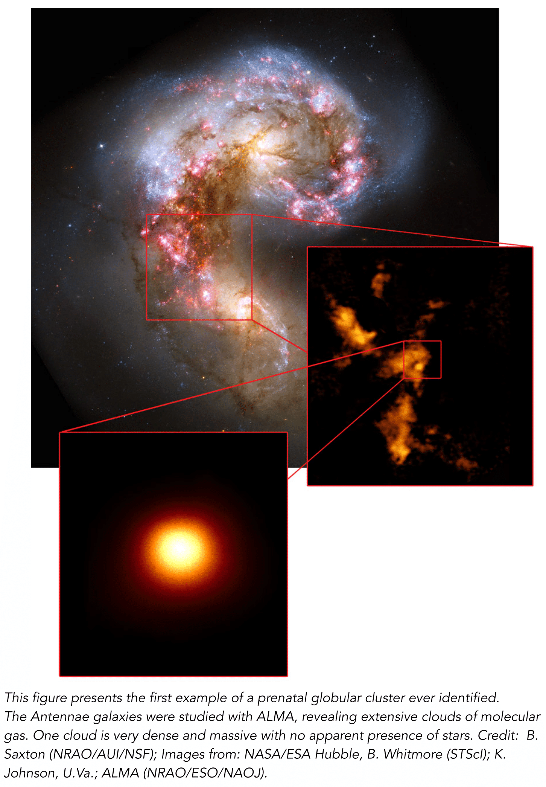

<link rel="stylesheet" href="styles.css" type="text/css">

*****

Stellar populations contain essential information on the formation and evolution of galaxies. 
We are able to trace the evolution of galaxies back to their formation by deriving elemental abundances of individual stars as well as measuring integrated light from unresolved stellar clusters. 
To understand how galaxies formed and evolved I followed different yet complementary lines of investigation.

I received my Ph.D. in astronomy titled ["Multiple stellar populations in globular clusters with photometry and low resolution spectroscopy"](http://amsdottorato.unibo.it/5204/) in 2013 from the University of Bologna (IT). 

I am currently an SNF Ambizione Fellow at the Laboratory of Astrophysics (LASTRO) of EPFL. Before moving to LASTRO in April 2017, I worked at the Astrophysics Reaserch Institute (LJMU, UK) and at the Bologna OBservatory (IT) as a PSRA.

